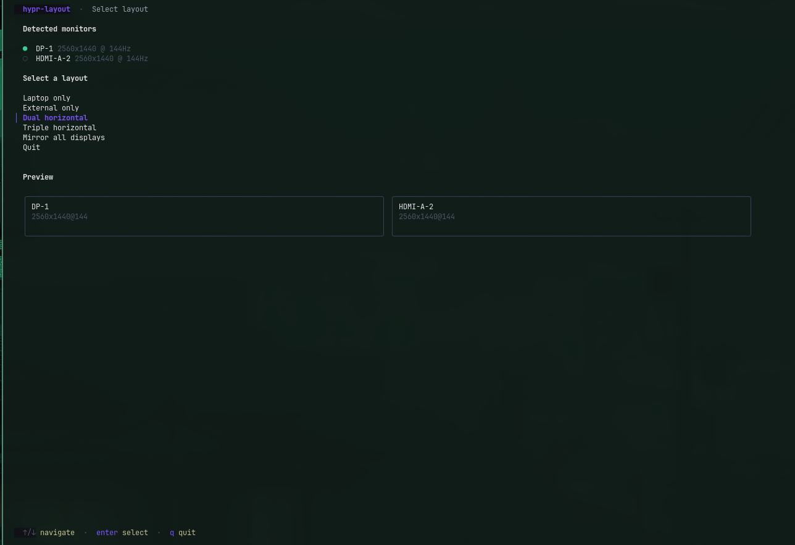
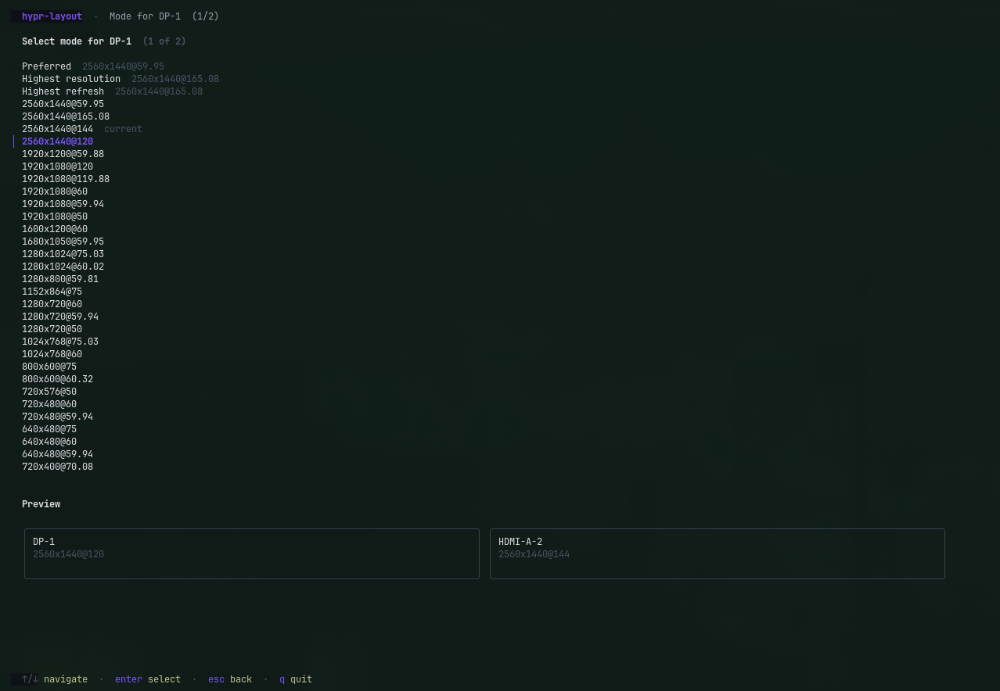
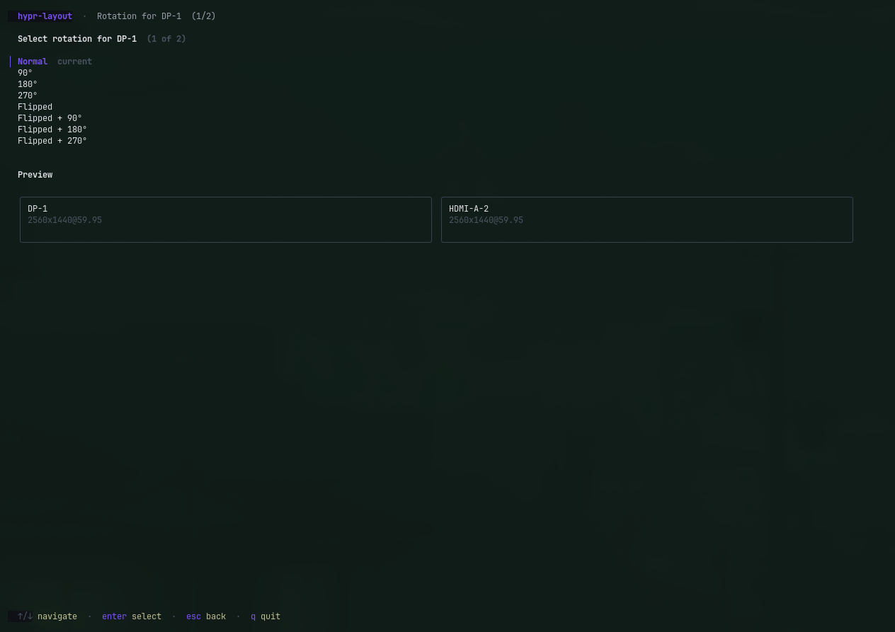

# hypr-layout

A TUI for managing Hyprland monitor layouts, so I don't have to hand-edit `~/.config/hypr/monitors.conf` every time I plug something in.

It reads your monitors from `hyprctl`, drops you on a single review screen with every setting already filled in, and lets you change only what you care about with a live preview of the arrangement. Applying writes the config safely — your old file gets backed up, and if the reload fails it rolls back automatically.

## Screenshots







## Features

- Monitor detection straight from `hyprctl monitors -j`
- Layout presets: laptop only, external only, dual, triple, mirror
- Per-monitor mode selection, with `preferred` / `highres` / `highrr` shortcuts
- Opens on your current settings, with pending changes highlighted
- One flat settings list — `enter` changes whatever is highlighted, and that is the only editing key
- Rotation (transform) and VRR per monitor — 90°/270° rotations are accounted for in positioning
- Stack monitors in any of the four directions, in any order
- Live proportional preview on every screen
- Timestamped backups and automatic rollback if `hyprctl reload` fails
- Named profiles you can apply later, plus export/import of all profiles as one JSON file
- `quick` presets for scripts — fully non-interactive with `--yes`

## Install

Needs Go 1.26+ and a running Hyprland session.

```bash
go install github.com/nsumbadze/hypr-layout/cmd/hypr-layout@latest
```

Or build from source:

```bash
git clone https://github.com/nsumbadze/hypr-layout.git
cd hypr-layout
make build
```

Make sure your Hyprland config sources the file this tool writes:

```ini
source = ~/.config/hypr/monitors.conf
```

## Usage

Run `hypr-layout` with no arguments. Pick a layout, and you land on the review
screen — one flat list where every row is a single named setting:

```
  DP-1
    Mode       2560x1440@165
  ▸ Rotation   Normal
    VRR        Off

  HDMI-A-2
    Mode       2560x1440@144
    Rotation   Normal
    VRR        Off

  Layout
    Direction  Left → right
    Order      DP-1 → HDMI-A-2

  Actions
    Save as profile
    Show config
```

Every row starts at what the monitor is running right now, so the screen reads
as your current setup rather than a proposed new one. Anything you change is
highlighted, so the highlights are exactly your pending changes. A live preview
of the arrangement sits below the list and updates as you go.

There are four keys:

| Key | Action |
| --- | --- |
| `↑`/`↓` (or `k`/`j`) | move between settings |
| `enter` | change the highlighted setting |
| `a` | apply — write the config and reload Hyprland |
| `q` | quit |

`enter` always means the same thing: change this one setting. It opens a list
for modes, rotation, VRR and direction; the reorder screen for `Order`; and
runs the two `Actions` rows. `esc` goes back from anywhere.

On the reorder screen, `shift`+`↑`/`↓` moves the highlighted monitor and the
preview follows along; `enter` keeps the new order and `esc` discards it.

Nothing is written until you press `a`. The previous `monitors.conf` is backed
up first, and a failed reload rolls back automatically.

### Quick presets

Skip the wizard entirely:

```bash
hypr-layout quick dual
hypr-layout quick mirror
hypr-layout quick dual --direction top-bottom --mode highres
hypr-layout quick triple --order "2 1 3"
hypr-layout quick external --transform 1 --vrr 1
hypr-layout quick dual --yes --no-reload
```

Presets: `laptop`, `external`, `dual`, `triple`, `mirror`.

Flags:

- `--direction` — `left-right` (default), `right-left`, `top-bottom`, `bottom-top`
- `--order` — monitor order by index, e.g. `"2 1 3"`
- `--mode` — `best` (default, highest refresh), `highres`, `preferred`, `current`, `highrr`
- `--transform` — Hyprland transform `0-7`, applied to all active monitors
- `--vrr` — `0` off, `1` on, `2` fullscreen only
- `--yes` — skip the apply confirmation
- `--no-reload` — write the config but don't reload Hyprland

### Profiles

Save a layout from the wizard, then:

```bash
hypr-layout list                    # saved profiles with their metadata
hypr-layout apply work --yes        # apply one, skipping confirmation
hypr-layout export profiles.json    # bundle all profiles into one file
hypr-layout import profiles.json    # restore them (--force to overwrite)
```

Profiles live in `~/.config/hypr-layout/profiles/` as plain config files with a small comment header (direction, monitors, save date), so they're readable and diffable.

## How it works

Positions are computed from the modes you pick, not from the current state — left-to-right stacks each monitor after the previous one's width, vertical layouts do the same with heights, and rotated monitors swap their dimensions. Mirror layouts use Hyprland's `mirror` keyword with the focused monitor as the source. Anything not part of the layout gets an explicit `disable` line.

A generated config looks like this:

```ini
monitor = DP-1, 2560x1440@165, 0x0, 1
monitor = HDMI-A-1, 1920x1080@60, 2560x0, 1, transform, 1
monitor = eDP-1, disable
```

Before writing, the existing `monitors.conf` is copied to `monitors.conf.backup-YYYYMMDD-HHMMSS`. If the reload fails, the backup is restored (or the new file removed if there was nothing before).

## Development

```bash
make build   # build ./cmd/hypr-layout
make run     # run it
make check   # fmt + vet + tests
```

Standard library plus the Charm stack (Bubble Tea, Lip Gloss) for the TUI. PRs welcome — keep changes small and covered by tests.

### Layout

```
cmd/hypr-layout      entry point
internal/hypr        hyprctl: monitor detection and reload
internal/layout      layout presets, modes, positioning
internal/monconf     writing monitors.conf, backup and rollback
internal/profile     saved profiles and import/export bundles
internal/cli         subcommands and non-interactive output
internal/tui         the wizard
internal/ui          shared styles and text helpers
```

`internal/layout` is where the real logic lives: it turns a set of monitors and
choices into config lines, and has no idea whether it was driven by the TUI or
by `quick`. Both front ends go through it, so they cannot drift.

## License

[MIT](LICENSE)
